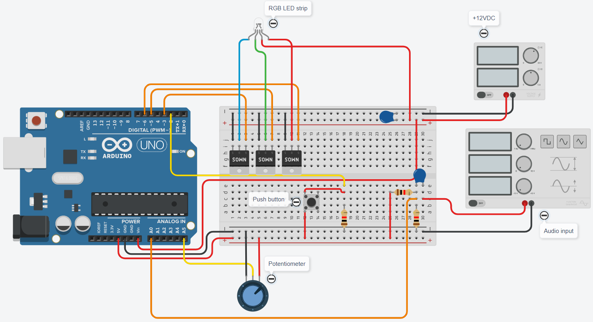
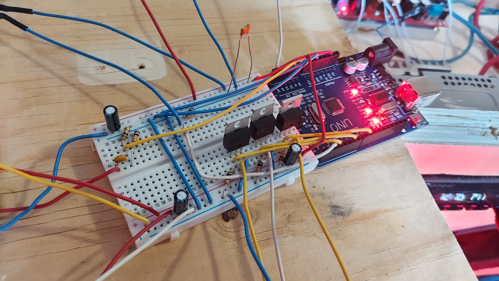
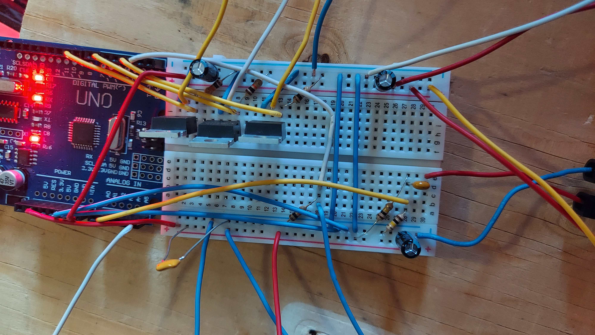
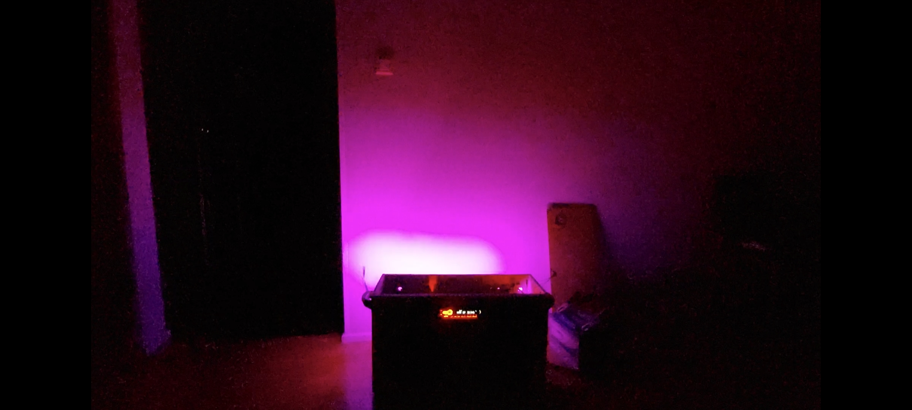
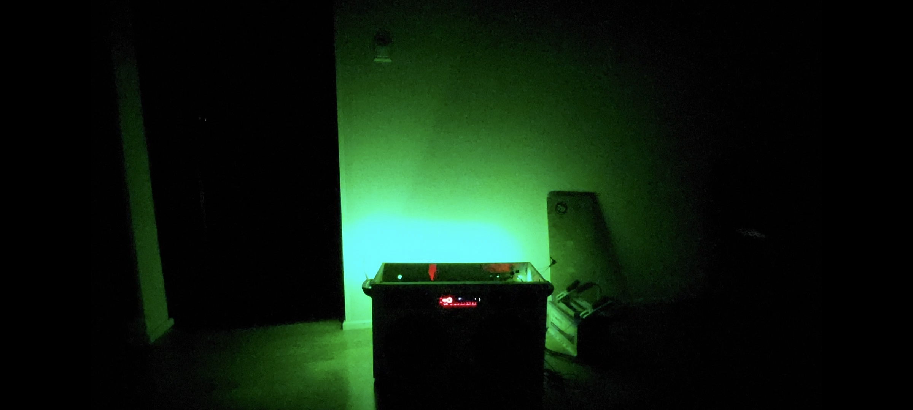
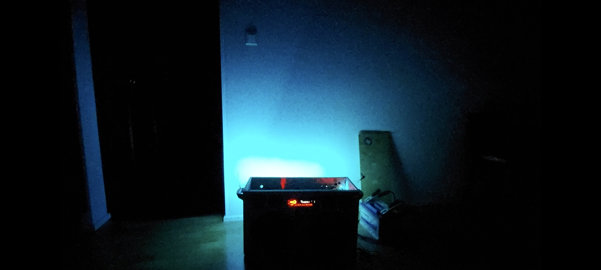

## Audiosignal To RGB LED strip

### A prototype for controlling the brightness of a led strip with an audio signal.

The audio signal was taken from a line-level output of a 12V car stereo.
A ceramic capacitor was placed in series in between the positive lead of the signal and the arduino analog input.
A 2.5VDC bias was created on the arduino side of the capacitor using two resistors, one connected to ground and the other to +5VDC.
The capacitor was used as a DC filter only allowing the AC signal to pass through and preventing the DC component from reaching the signal source.

A push button and a potentiometer were used for toggling the different modes and adjusting the color of the RGB LED strip.

Three logic-level mosfets were placed in between the led strip and the digital outputs of the arduino for controlling the LEDs with a PWM signal.

The system worked great for a prototype but the PWM signal of the arduino seemed to produce slight interference/noise that traveled to the amplifier of the car stereo and ended up causing a buzzing sound from the speakers.

If I were to refine the system further, I'd propably add a ground loop isolator and an opto-isolator or some other component for filtering out the interference.

### Schematic

### Breadboard wiring

### In action

